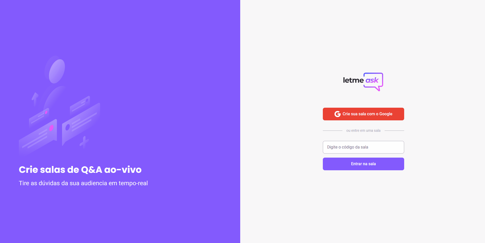
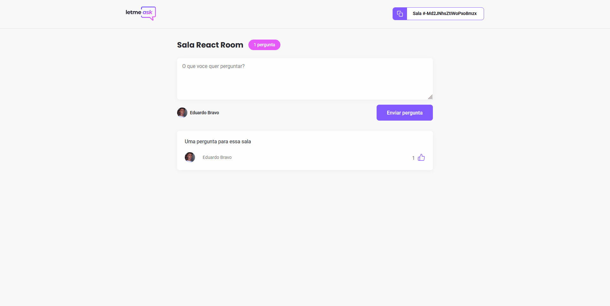
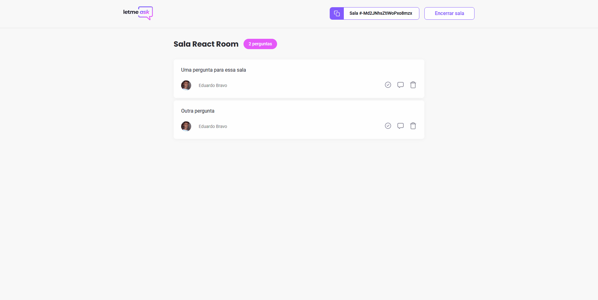

<div align="center">
  
  <h1 align="center">Q&A App</h1>
  <hr />
</div>





## About 🔎:
#### This APP provides multiple features, such as:
- SignIn with Google;
- Join a room;
- Ask questions in the room;
- Like other questions;
- Admin page to administrate the room;
- Realtime updates;
<hr />

## Technologies 💻:
- React
- Context API
- Firebase - Realtime database
- SCSS

## Site
https://letmeask-fe30b.web.app

## How to Run 🚀:
```bash
# Clone this repository
$ git clone https://github.com/EduardoBravoP/letmeask.git

# Go into the repository
$ cd letmeask

# Install dependencies
$ yarn

# Run the app
$ yarn start

# And it's ready on localhost:3000
```